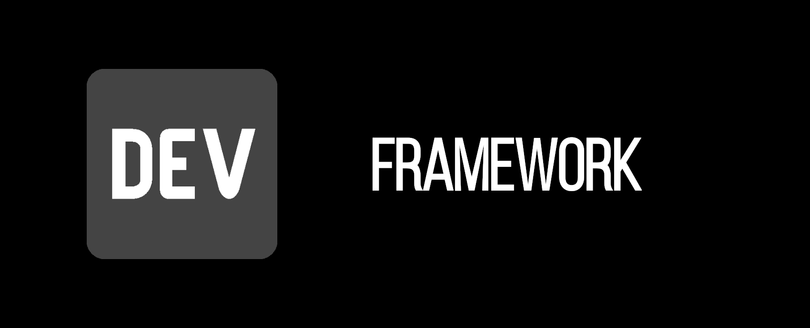

<h1 align="center">
  
</h1>

 

  

  

  

  

  

  

 

# :book: Sobre

Esse repositório é destinado ao desenvolvimento de um framework padrão e páginas inicias para novos projetos em PHP.

 

# :computer: Tecnologias

- [PHP](https://www.php.net/) - v7.3.14
- [jQuery](https://jquery.com/) - v3.5.1

 

# :book: Funções do Sistema

- **Página Login**
  - Possibilidade de acesso ao sistema utilizando um nome de usuário ou e-mail e uma senha.
    - **OBS:** forma de login será configurável via banco de dados (padrão **usuário**).

 

- **Página Home** (pós login)
  - Possibilidade de conter um **dashboard** com informações gerais do sistema e/ou avisos.

 

# :clap: Agradecimentos

Todo o conteúdo apresentado aqui não seria possível graças a algumas pessoas e/ou empresas:

- [Font Awesome](https://fontawesome.com/): logo, favicon e ícones
- [Bootstrap Team](https://getbootstrap.com/docs/4.5/examples/): tema do portal

 

# :exclamation: Avisos

O conteúdo desse **README** será atualizado conforme o desenvolvimento do framework. :wink:

 

# :memo: License

Esse projeto está sob a licença MIT. Consulte [LICENSE](https://github.com/NouRuem/php-framework/blob/main/LICENSE.md) para mais informações.

 

# :speech_balloon: Contato

Desenvolvido por **Allan Cabral**.

**E-mail:** [allancruz93@gmail.com](mailto:allancruz93@gmail.com)

**Linkedin:** [Allan Cabral](https://www.linkedin.com/in/allan-cabral/)
